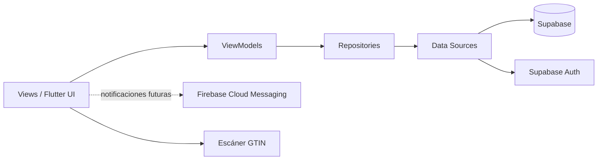

<p align="center">
  
</p>

<h1 align="center">SITRA-Luz</h1>

<p align="center">
  <strong>Sistema de Trazabilidad y Dispensación de Medicamentos</strong><br>
  Clínica La Luz · Tacna, Perú
</p>

<p align="center">
  Aplicación móvil desarrollada con Flutter para digitalizar el flujo interno de medicamentos,
  controlar inventario por áreas, registrar movimientos y mejorar la trazabilidad entre
  Almacén, Farmacia y áreas clínicas.
</p>

---

## 📝 Registro de Cambios (Examen Unidad 1)

A continuación se detallan las implementaciones realizadas en el proyecto, junto con los archivos y secciones afectadas:

### 1. Saneamiento de Entradas (Punto 2)
Se diseñó una clase utilitaria pura, completamente desacoplada de la interfaz gráfica y de red, responsable de limpiar las entradas del usuario (trim, colapso de espacios, eliminación de caracteres de control).
* **Archivos creados/afectados:**
  * `app/lib/core/utils/input_sanitizer.dart` (Nueva clase `InputSanitizer`)

### 2. Reglas de Validación Previas a la Red (Punto 3)
Se implementaron reglas de negocio (DNI de 8 dígitos, formato de correo, etc.) que se verifican *antes* de realizar cualquier petición al servidor, abortando el flujo de manera controlada en caso de error.
* **Archivos creados/afectados:**
  * `app/lib/core/utils/validation_exception.dart` (Nueva excepción `ValidationException`)
  * `app/lib/core/utils/input_validator.dart` (Nueva clase `InputValidator` que encapsula las reglas)
  * `app/lib/features/auth/presentation/viewmodels/auth_viewmodel.dart` (Modificado el método `login()` para interceptar el envío y validar localmente)

### 3. Pruebas Unitarias de Autenticación y Flujo (Punto 4)
Se programó una suite de pruebas para validar los estados del ViewModel de autenticación sin depender de servicios externos, utilizando un mock del repositorio.
* **Archivos creados/afectados:**
  * `app/test/auth_viewmodel_test.dart` (Nuevos tests comprobando el estado en frío, flujo exitoso y flujo denegado)

### 4. Pruebas Unitarias de Saneamiento y Rechazo (Punto 5)
Se desarrollaron aserciones para verificar la correcta limpieza de cadenas complejas y demostrar, mediante contadores (spies), que ante entradas inválidas el repositorio no recibe ninguna llamada.
* **Archivos creados/afectados:**
  * `app/test/sanitizer_validator_test.dart` (Nuevos tests de saneamiento efectivo e interrupción de peticiones a la red)

---

## Descripción

**SITRA-Luz** es una aplicación móvil orientada a la gestión y trazabilidad interna de medicamentos e insumos médicos en la Clínica La Luz.

El proyecto busca cubrir procesos que normalmente se realizan de forma manual o mediante registros dispersos, especialmente en el flujo interno:

```text
Proveedor
   ↓
Almacén General
   ↓
Farmacia Central
   ↓
Áreas clínicas / Enfermería
```

La aplicación centraliza autenticación, roles, catálogo de medicamentos, lotes, stock, transferencias, solicitudes de abastecimiento y trazabilidad, utilizando una arquitectura móvil basada en Flutter y un backend principal en Supabase.

---

## Objetivo del proyecto

Digitalizar y controlar el flujo interno de medicamentos e insumos médicos de la clínica, proporcionando:

- autenticación segura de usuarios;
- control de acceso según rol;
- catálogo centralizado de medicamentos;
- gestión de lotes y vencimientos;
- control de stock por área;
- transferencias entre Almacén y Farmacia;
- solicitudes de abastecimiento;
- registro asistido mediante lectura de códigos GTIN/GS1;
- trazabilidad de movimientos;
- soporte futuro para notificaciones push;
- base para módulos de dispensación, auditoría y reportes.

---

## Arquitectura tecnológica

El proyecto utiliza una arquitectura basada en **MVVM + Repository**, con separación entre presentación, dominio y acceso a datos.



### Flujo principal

```text
View
  ↓
ViewModel
  ↓
Repository
  ↓
DataSource
  ↓
Supabase / servicios externos
```

---

## Stack tecnológico

| Capa | Tecnología |
|---|---|
| Aplicación móvil | Flutter / Dart |
| Gestión de estado | Provider |
| Navegación | GoRouter |
| Backend principal | Supabase |
| Base de datos | PostgreSQL |
| Autenticación | Supabase Auth |
| Seguridad de datos | Row Level Security (RLS) |
| Escaneo GTIN | `mobile_scanner` |
| Captura de imágenes | `image_picker` |
| Notificaciones | Firebase Cloud Messaging |
| CI/CD | GitHub Actions |
| Control de versiones | Git / GitHub |

> **Importante:** Supabase es el backend principal del sistema. Firebase se reserva exclusivamente para notificaciones push mediante FCM y actualmente se encuentra desactivado mediante una feature flag hasta una fase posterior.

---

## Roles del sistema

SITRA-Luz contempla cinco perfiles principales:

| Rol | Responsabilidad principal |
|---|---|
| Administrador | Administración general, usuarios y configuración |
| Jefatura de Farmacia | Supervisión, control y reportes |
| Farmacia | Preparación, despacho y gestión de solicitudes |
| Almacén | Inventario, lotes, registro y transferencias |
| Enfermería / Técnico | Solicitud y recepción de medicamentos e insumos |

La aplicación utiliza el rol almacenado en la tabla `profiles` de Supabase para dirigir al usuario al módulo correspondiente.

---

## Módulos principales

### Autenticación y control de acceso

El sistema cuenta con autenticación mediante **Supabase Auth** y consulta del perfil del usuario en PostgreSQL.

Actualmente incluye:

- inicio de sesión con correo y contraseña;
- validación de credenciales;
- lectura de perfil desde `profiles`;
- identificación del rol del usuario;
- redirección mediante GoRouter;
- cierre de sesión;
- manejo de errores de conectividad;
- dashboards independientes para los cinco roles.

### Catálogo de medicamentos

El módulo de Almacén permite trabajar con el catálogo general almacenado en Supabase.

Incluye:

- consulta de medicamentos activos;
- búsqueda y filtrado;
- registro de medicamentos;
- edición de medicamentos existentes;
- información farmacéutica y de presentación;
- soporte para código GTIN;
- integración con lotes e inventario.

### Lotes e inventario

El proyecto incorpora estructuras para administrar:

- medicamentos;
- lotes;
- fechas de vencimiento;
- stock por área;
- ingresos de mercadería;
- movimientos de inventario;
- auditoría de operaciones.

La base de datos se encuentra definida mediante scripts SQL dentro de:

```text
docs/supabase/
```

### Transferencias Almacén → Farmacia

El módulo de Almacén permite registrar movimientos de stock desde Almacén General hacia Farmacia Central.

El flujo implementado contempla:

1. validar el stock disponible;
2. descontar la cantidad del Almacén;
3. incrementar o crear el stock correspondiente en Farmacia;
4. registrar el movimiento en auditoría.

> Actualmente el flujo funcional existe, pero la atomicidad completa de la operación debe reforzarse mediante una función/RPC transaccional en PostgreSQL antes de considerarlo cerrado a nivel de producción.

### Solicitudes de abastecimiento

Existe soporte para consultar y atender solicitudes provenientes de Farmacia.

Actualmente se dispone de:

- modelo de solicitud;
- tabla de solicitudes en Supabase;
- detalle de ítems;
- bandeja para Almacén;
- cambio de estado de solicitudes;
- registro de auditoría.

La creación completa de solicitudes desde el módulo de Farmacia continúa como parte del desarrollo pendiente.

### Escaneo GTIN

El proyecto incorpora lectura de códigos GTIN/GS1 utilizando la cámara del dispositivo.

Características actuales:

- lectura local del código de barras;
- funcionamiento sin necesidad de conexión durante el escaneo;
- captura opcional de imagen de la caja;
- integración con el flujo de registro de medicamentos;
- formulario de revisión y corrección.

El procesamiento real mediante Gemini todavía no se encuentra conectado a una API externa. El servicio actual utiliza datos de demostración y lógica simulada para representar el flujo de extracción.

---

## Supabase

Supabase concentra la autenticación y persistencia principal del proyecto.

Entre las estructuras utilizadas se encuentran:

```text
profiles
medicamentos
lotes
inventario_stock
pedidos_abastecimiento
pedidos_abastecimiento_items
dispensaciones
auditoria_trazabilidad
```

La configuración y scripts necesarios se encuentran en:

```text
docs/supabase/
├── GUIA_SUPABASE.md
├── crear_usuarios_roles.sql
└── setup_sitra_luz.sql
```

### Decisión arquitectónica

La arquitectura original evaluó Firebase y un modelo híbrido, pero posteriormente el proyecto consolidó:

```text
Supabase PostgreSQL
        +
Supabase Auth
        +
Firebase FCM únicamente para notificaciones
```

La decisión está documentada en:

```text
docs/decisiones/ADR-003-migracion-supabase-fcm.md
```

---

## Firebase Cloud Messaging

Firebase permanece en el proyecto exclusivamente como infraestructura para notificaciones push.

Actualmente:

```dart
NotificationService.enablePushNotifications = false;
```

Por lo tanto:

- Firebase no almacena los datos principales;
- Firebase Auth no es utilizado;
- Firestore no es utilizado como base de datos principal;
- FCM será habilitado en una etapa posterior.

---

## Estructura principal del proyecto

```text
SITRA-Luz/
├── .github/
│   └── workflows/
│       ├── ci.yml
│       └── flutter_ci.yml
│
├── app/
│   ├── android/
│   ├── assets/
│   ├── lib/
│   │   ├── core/
│   │   │   ├── config/
│   │   │   ├── routes/
│   │   │   ├── services/
│   │   │   ├── theme/
│   │   │   └── widgets/
│   │   │
│   │   ├── features/
│   │   │   ├── auth/
│   │   │   ├── almacen/
│   │   │   ├── dashboard_admin/
│   │   │   ├── dashboard_almacen/
│   │   │   ├── dashboard_enfermeria/
│   │   │   ├── dashboard_farmacia/
│   │   │   └── dashboard_jefatura/
│   │   │
│   │   └── main.dart
│   │
│   ├── test/
│   └── pubspec.yaml
│
├── docs/
│   ├── contexto/
│   ├── decisiones/
│   ├── equipo/
│   ├── producto/
│   └── supabase/
│
├── CONTRIBUTING.md
├── CONVENTIONS.md
└── README.md
```

---

## Arquitectura por feature

Las funcionalidades siguen una separación similar a:

```text
features/
└── modulo/
    ├── data/
    │   ├── datasources/
    │   ├── models/
    │   ├── repositories/
    │   └── services/
    │
    ├── domain/
    │   ├── entities/
    │   └── repositories/
    │
    └── presentation/
        ├── states/
        ├── viewmodels/
        └── views/
```

Esto permite mantener desacopladas:

- interfaz gráfica;
- lógica de presentación;
- reglas de dominio;
- persistencia;
- servicios externos.

---

## Requisitos

Para ejecutar el proyecto se recomienda contar con:

- Flutter estable;
- Dart `^3.9.2`;
- Android Studio;
- Android SDK;
- Git;
- una instancia de Supabase configurada;
- emulador Android o dispositivo físico.

El proyecto está orientado principalmente a dispositivos móviles.

Requisitos mínimos definidos por el sistema:

- Android 9 / API 28 o superior;
- iOS 14 o superior.

El desarrollo y las pruebas actuales se concentran principalmente en Android.

---

## Instalación

### 1. Clonar el repositorio

```bash
git clone https://github.com/Brunoenr02/SITRA-Luz.git
cd SITRA-Luz
```

Si deseas trabajar directamente con la rama de desarrollo actual:

```bash
git switch Sprint-02
```

### 2. Ingresar al proyecto Flutter

```bash
cd app
```

### 3. Instalar dependencias

```bash
flutter pub get
```

### 4. Verificar el entorno

```bash
flutter doctor
```

Para listar dispositivos disponibles:

```bash
flutter devices
```

---

## Configuración de Supabase

El proyecto utiliza:

```text
app/lib/core/config/supabase_config.dart
```

Debes configurar:

```text
SUPABASE_URL
SUPABASE_ANON_KEY
```

No utilices una `service_role` dentro de la aplicación móvil.

Después, ejecuta el script:

```text
docs/supabase/setup_sitra_luz.sql
```

desde el SQL Editor de Supabase.

También puedes consultar:

```text
docs/supabase/GUIA_SUPABASE.md
```

para revisar la configuración completa.

---

## Ejecutar la aplicación

Con un emulador o dispositivo Android conectado:

```bash
flutter run
```

Para seleccionar un dispositivo específico:

```bash
flutter devices
flutter run -d <device-id>
```

---

## Ejecutar pruebas

```bash
flutter test
```

---

## Análisis estático

```bash
flutter analyze
```

---

## Generar APK

```bash
flutter build apk --release
```

El APK generado estará disponible normalmente en:

```text
build/app/outputs/flutter-apk/app-release.apk
```

---

## Integración continua

El repositorio utiliza GitHub Actions.

### Flutter CI

El flujo principal ejecuta:

```text
flutter pub get
flutter analyze
flutter test
flutter build apk --release
```

sobre ramas como:

```text
main
develop
Sprint-*
```

### Calidad y seguridad

El proyecto también incluye verificaciones orientadas a:

- análisis estático;
- pruebas;
- cobertura;
- detección de secretos mediante Trivy.

Los workflows se encuentran en:

```text
.github/workflows/
```

---

## Seguridad

El proyecto contempla varias medidas de seguridad:

- autenticación mediante Supabase Auth;
- contraseñas administradas por el proveedor de autenticación;
- perfiles asociados a `auth.users`;
- Row Level Security en PostgreSQL;
- separación de roles;
- auditoría de operaciones;
- validación de sesiones;
- escaneo de secretos mediante CI.

No deben almacenarse en el repositorio:

- contraseñas;
- claves privadas;
- `service_role`;
- tokens personales;
- secretos de APIs externas.

---

## Estado actual

### Implementado

- [x] Proyecto Flutter operativo
- [x] Arquitectura MVVM / Repository
- [x] Supabase como backend principal
- [x] Supabase Auth
- [x] Tabla de perfiles y roles
- [x] Cinco roles de usuario
- [x] Login
- [x] Navegación con GoRouter
- [x] Dashboards por rol
- [x] Tema visual de SITRA-Luz
- [x] Catálogo de medicamentos
- [x] Registro de medicamentos
- [x] Edición de medicamentos
- [x] Gestión de lotes
- [x] Inventario de Almacén
- [x] Transferencia de stock hacia Farmacia
- [x] Auditoría de movimientos
- [x] Lectura GTIN mediante cámara
- [x] Captura opcional de imagen
- [x] Bandeja de solicitudes para Almacén
- [x] CI con GitHub Actions

### En desarrollo / mejora

- [ ] Vista consolidada completa de stock Farmacia + Almacén
- [ ] Transferencia de stock completamente atómica mediante PostgreSQL
- [ ] Creación de solicitudes desde Farmacia
- [ ] Protección estricta de todas las rutas por rol
- [ ] Integración real con Gemini
- [ ] Validación IA de medicamentos
- [ ] Activación de Firebase Cloud Messaging
- [ ] Expiración configurable de sesión

### Próximos módulos

- [ ] Fichas de pedido
- [ ] Flujo de preparación y dispensación
- [ ] Confirmación de recojo
- [ ] Descuento automático de stock
- [ ] Kits de Neonatología
- [ ] Gestión completa de usuarios
- [ ] Trazabilidad histórica
- [ ] Dashboard de Jefatura
- [ ] Alertas de stock crítico
- [ ] Gestión FEFO
- [ ] Exportación de fichas a PDF
- [ ] Integración con Google Drive

---

## Requerimientos del sistema

La documentación funcional del proyecto contempla requerimientos relacionados con:

- autenticación;
- control por roles;
- fichas de pedido;
- catálogo;
- inventario;
- lotes;
- GTIN;
- abastecimiento;
- trazabilidad;
- usuarios;
- reportes;
- PDF;
- Google Drive;
- notificaciones.

La especificación completa se encuentra en:

```text
docs/contexto/requerimientos.md
```

---

## Equipo

**Grupo 04 — Universidad Privada de Tacna**

| Integrante | Rol |
|---|---|
| Bruno Ancco Suaña | Scrum Master · Developer |
| Walter Sala Jimenez | Product Owner · Developer |
| David Anampa | Developer · QA |

Curso:

```text
Soluciones Móviles II — SI-988
```

---

## Convenciones de desarrollo

El repositorio cuenta con documentación específica para mantener consistencia durante el desarrollo:

```text
CONVENTIONS.md
CONTRIBUTING.md
```

Se recomienda utilizar Conventional Commits:

```text
feat:
fix:
docs:
refactor:
test:
build:
ci:
```

Ejemplo:

```bash
git commit -m "feat(almacen): implementar registro de lotes"
```

---

## Flujo de trabajo recomendado

```bash
git pull
git switch <rama>
git add .
git commit -m "tipo(modulo): descripcion"
git push
```

Antes de realizar un push:

```bash
cd app
flutter pub get
flutter analyze
flutter test
```

---

## Visión del proyecto

SITRA-Luz busca convertirse en una solución móvil que permita conocer:

- qué medicamento ingresó;
- a qué lote pertenece;
- cuánto stock existe;
- dónde se encuentra;
- quién realizó cada movimiento;
- cuándo ocurrió;
- hacia qué área fue transferido o dispensado.

El objetivo final es contar con una trazabilidad digital completa del medicamento dentro del flujo interno de la clínica.

---

<p align="center">
  <strong>SITRA-Luz</strong><br>
  Sistema de Trazabilidad y Dispensación de Medicamentos
</p>
