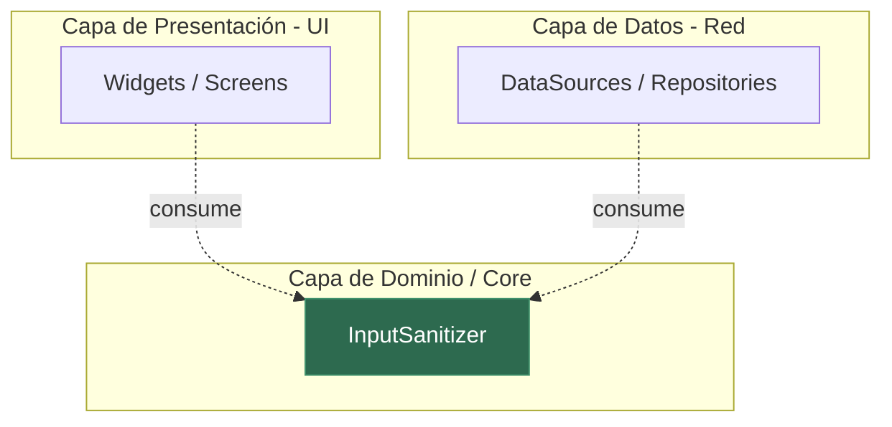

# Evidencia — Punto 2: Clase Utilitaria de Saneamiento de Entradas

## 📍 Ubicación del archivo

```
app/lib/core/utils/input_sanitizer.dart
```

[Abrir archivo → input_sanitizer.dart](file:///c:/Users/SISTEMAS/Documents/Walter/UPT/MOVILES/EXAMEN%20U1/SITRA-Luz/app/lib/core/utils/input_sanitizer.dart)

---

## ✅ Desacoplamiento Arquitectural — Cabecera de Imports

> [!IMPORTANT]
> El archivo **no contiene ningún import**. Solo utiliza `dart:core`, que es implícito en Dart y no necesita declararse.

```dart
// ============================================================================
// Archivo  : input_sanitizer.dart
// Ubicación: lib/core/utils/input_sanitizer.dart
// Proyecto : SITRA-Luz • Clínica La Luz
// ----------------------------------------------------------------------------
// DESACOPLAMIENTO ARQUITECTURAL:
//   • NO importa bibliotecas de renderizado visual (flutter/material.dart,
//     flutter/widgets.dart, flutter/cupertino.dart, etc.).
//   • NO importa bibliotecas de red/HTTP (http, dio, supabase_flutter, etc.).
//   • Solo utiliza 'dart:core' (implícito) — sin dependencias externas.
// ============================================================================
```

**No hay líneas `import`** → La clase está 100% desacoplada de:
- ❌ Flutter / Material / Widgets (sin UI)
- ❌ HTTP / Dio / Supabase (sin red)
- ❌ Firebase / cualquier servicio externo

---

## 🏗️ Declaración de la Clase

```dart
class InputSanitizer {
  // Constructor privado: esta clase es puramente estática (no se instancia).
  InputSanitizer._();
  // ...
}
```

| Aspecto | Detalle |
|---|---|
| **Tipo** | Clase utilitaria pura (métodos estáticos) |
| **Instanciación** | Bloqueada con constructor privado `InputSanitizer._()` |
| **Dependencias** | Ninguna (solo `dart:core` implícito) |
| **Ubicación** | `lib/core/utils/` — capa de dominio/utilidades |

---

## 🔧 Métodos Implementados

### Métodos base

| Método | Responsabilidad |
|---|---|
| `removeControlCharacters(String)` | Suprime caracteres de control no imprimibles (C0, C1, DEL) |
| `collapseWhitespace(String)` | Colapsa espacios internos duplicados en uno solo |
| `sanitize(String)` | Pipeline completo: remover controles → colapsar espacios → trim |

### Métodos especializados por tipo de campo

| Método | Campo | Tratamiento adicional |
|---|---|---|
| `sanitizeEmail(String)` | Correo electrónico | Pipeline base + conversión a minúsculas |
| `sanitizeDni(String)` | DNI | Pipeline base + solo dígitos numéricos |
| `sanitizeName(String)` | Nombre completo | Pipeline base + solo letras/tildes/espacios |
| `sanitizeCode(String)` | Código alfanumérico | Pipeline base + mayúsculas + alfanumérico y guiones |

---

## 📐 Diagrama de Arquitectura



> [!TIP]
> La clase `InputSanitizer` vive en `core/utils/` y puede ser consumida por cualquier capa (presentación, datos) sin crear acoplamiento inverso, ya que ella misma no importa nada de esas capas.

---

## 📸 Para la Captura del PDF

Para la evidencia en PDF, captura:

1. **El archivo completo** [`input_sanitizer.dart`](file:///c:/Users/SISTEMAS/Documents/Walter/UPT/MOVILES/EXAMEN%20U1/SITRA-Luz/app/lib/core/utils/input_sanitizer.dart) — mostrando que la cabecera de imports está vacía (sin imports de UI ni HTTP).
2. **La declaración de la clase** `class InputSanitizer` con su constructor privado.
3. **La estructura de carpetas** mostrando su ubicación en `lib/core/utils/`.
