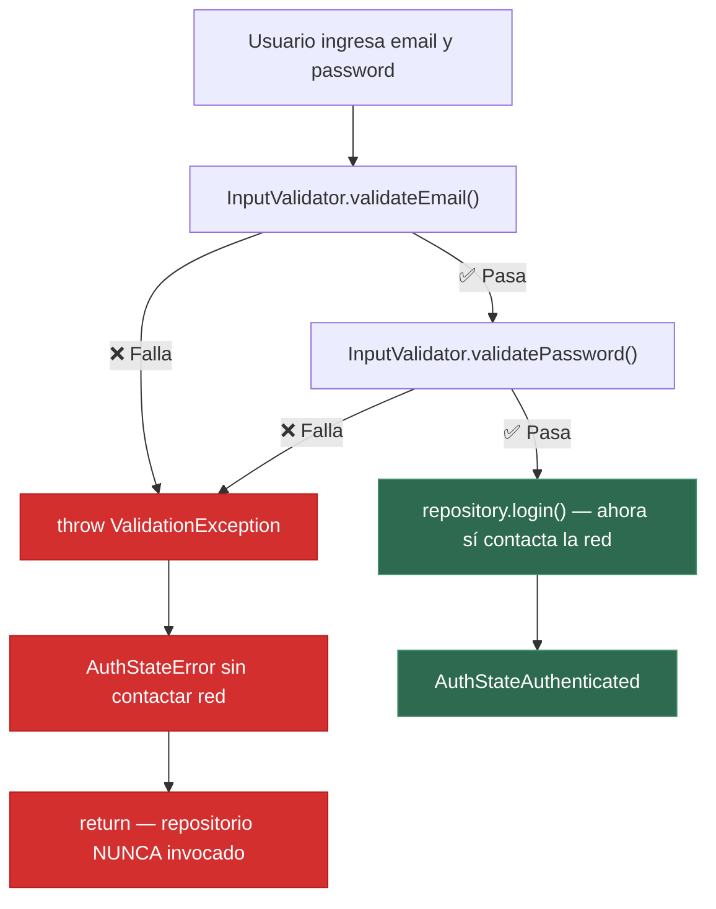

# Evidencia — Punto 3: Reglas de Validación Previas a la Capa de Red

## 📍 Archivos involucrados

| Archivo | Ubicación | Rol |
|---|---|---|
| [`validation_exception.dart`](file:///c:/Users/SISTEMAS/Documents/Walter/UPT/MOVILES/EXAMEN%20U1/SITRA-Luz/app/lib/core/utils/validation_exception.dart) | `lib/core/utils/` | Excepción controlada (sin imports de UI/red) |
| [`input_validator.dart`](file:///c:/Users/SISTEMAS/Documents/Walter/UPT/MOVILES/EXAMEN%20U1/SITRA-Luz/app/lib/core/utils/input_validator.dart) | `lib/core/utils/` | Función validadora con reglas de negocio |
| [`auth_viewmodel.dart`](file:///c:/Users/SISTEMAS/Documents/Walter/UPT/MOVILES/EXAMEN%20U1/SITRA-Luz/app/lib/features/auth/presentation/viewmodels/auth_viewmodel.dart) | `features/auth/presentation/viewmodels/` | Caso de uso donde se intercepta el envío |

---

## ✅ Función Validadora — `InputValidator`

> [!IMPORTANT]
> Solo importa `InputSanitizer` y `ValidationException` (ambas desacopladas de UI y red).

```dart
// Imports — solo clases propias de dominio, sin UI ni HTTP
import 'input_sanitizer.dart';
import 'validation_exception.dart';

class InputValidator {
  InputValidator._();

  // Reglas de negocio:
  static const int dniLength = 8;           // DNI peruano = exactamente 8 dígitos
  static const int passwordMinLength = 6;   // Contraseña mínima
  static const int nameMinLength = 3;       // Nombre mínimo

  // Validación de email con formato RFC 5322
  static String validateEmail(String input) { ... }

  // Validación de DNI: exactamente 8 dígitos
  static String validateDni(String input) { ... }

  // Validación de nombre completo
  static String validateName(String input) { ... }

  // Validación de contraseña
  static String validatePassword(String input) { ... }

  // Validación de código alfanumérico
  static String validateCode(String input, { ... }) { ... }
}
```

### Reglas de negocio implementadas

| Método | Regla | Excepción si falla |
|---|---|---|
| `validateEmail()` | Formato RFC + dominio válido | `"El formato del correo electrónico no es válido"` |
| `validateDni()` | Exactamente 8 dígitos numéricos | `"El DNI debe tener exactamente 8 dígitos"` |
| `validateName()` | 3–100 caracteres, solo letras/tildes | `"El nombre debe tener al menos 3 caracteres"` |
| `validatePassword()` | Mínimo 6 caracteres | `"La contraseña debe tener al menos 6 caracteres"` |
| `validateCode()` | Longitud configurable, alfanumérico | `"El código debe tener al menos N caracteres"` |

---

## 🛡️ Excepción Controlada — `ValidationException`

```dart
// SIN imports de UI ni HTTP — solo dart:core

class ValidationException implements Exception {
  final String message;
  final String? field;

  const ValidationException(this.message, {this.field});
}
```

---

## 🔗 Interceptación en el Caso de Uso — `AuthViewModel.login()`

> [!IMPORTANT]
> Este es el bloque clave donde se **intercepta el envío y se rechaza la llamada al repositorio**.

```dart
Future<void> login({
  required String email,
  required String password,
}) async {
  // ─── PASO 1: Validación ANTES de la capa de red ───
  final String validatedEmail;
  final String validatedPassword;

  try {
    validatedEmail = InputValidator.validateEmail(email);
    validatedPassword = InputValidator.validatePassword(password);
  } on ValidationException catch (e) {
    // ── INTERCEPTACIÓN: Se rechaza la llamada al repositorio ──
    _setState(AuthStateError(e.message));
    return; // ← Sale sin invocar al repositorio
  }

  // ─── PASO 2: Solo si pasa la validación → se contacta la red ───
  _setState(const AuthStateLoading());
  try {
    final user = await _repository.login(
      email: validatedEmail,
      password: validatedPassword,
    );
    _currentUser = user;
    _setState(AuthStateAuthenticated(user));
  } on AuthException catch (e) {
    _setState(AuthStateError(e.message));
  }
}
```

---

## 📐 Flujo de Validación



---

## 📸 Para la Captura del PDF

Para la evidencia en PDF, captura:

1. **[`input_validator.dart`](file:///c:/Users/SISTEMAS/Documents/Walter/UPT/MOVILES/EXAMEN%20U1/SITRA-Luz/app/lib/core/utils/input_validator.dart)** — Código de la función validadora completa (imports + clase + métodos).
2. **[`validation_exception.dart`](file:///c:/Users/SISTEMAS/Documents/Walter/UPT/MOVILES/EXAMEN%20U1/SITRA-Luz/app/lib/core/utils/validation_exception.dart)** — Excepción controlada.
3. **[`auth_viewmodel.dart`](file:///c:/Users/SISTEMAS/Documents/Walter/UPT/MOVILES/EXAMEN%20U1/SITRA-Luz/app/lib/features/auth/presentation/viewmodels/auth_viewmodel.dart) — método `login()`** — El bloque donde se intercepta el envío y se rechaza la llamada al repositorio con `ValidationException`.
